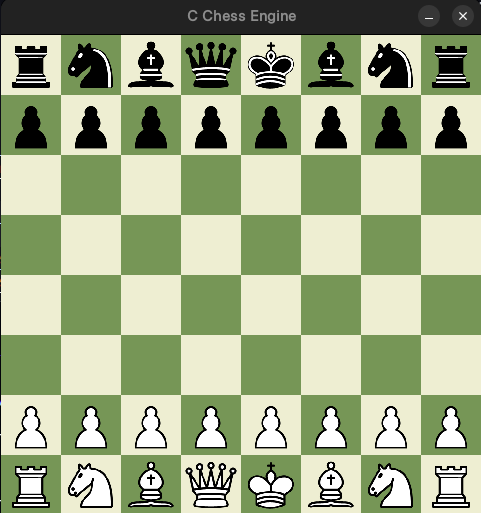

# ♟️ C Chess Engine

> A sophisticated chess game and engine built from scratch in C, featuring SDL2 graphics and advanced AI algorithms

[](https://github.com/yourusername/chess-engine)
[](LICENSE)
[](https://en.wikipedia.org/wiki/C_(programming_language))
[](https://github.com/yourusername/chess-engine)



---

## 🎯 Overview

This project implements a complete chess game engine with a graphical interface, featuring full chess rules, special moves, and an intelligent AI opponent. Built using classical chess programming techniques with modern C development practices.

## ✨ Features

### 🎮 Core Game Logic
- **🏁 Complete Chess Rules**: Full implementation of standard chess rules including piece movements, captures, and proper board setup
- **🎭 Special Moves**:
  - **🏰 Castling**: King-side and Queen-side castling with comprehensive condition checking
  - **👻 En Passant**: Accurate en passant capture detection and execution
  - **👑 Pawn Promotion**: Automatic queen promotion when pawns reach the final rank
- **⚔️ Check & Checkmate**: Precise detection of check positions and checkmate scenarios
- **🎲 Game Termination**:
  - **💀 Checkmate**: Automatic winner declaration
  - **🤝 Stalemate**: Proper stalemate detection resulting in draws
  - **⚖️ Insufficient Material**: Recognition of unwinnable endgames
  - **📊 50-Move Rule**: Automatic draw declaration after 50 moves without progress

### 🤖 Advanced AI Opponent

Our AI engine employs cutting-edge chess programming techniques:

| Algorithm | Description |
|-----------|-------------|
| **🧠 Minimax with Alpha-Beta** | Core decision-making algorithm with efficient pruning |
| **⏱️ Iterative Deepening** | Time-controlled search with increasing depth |
| **🎯 Advanced Evaluation** | Sophisticated position assessment beyond material count |
| **📍 Piece-Square Tables** | Positional scoring for strategic piece placement |
| **🔍 Quiescence Search** | Extended search for tactical positions |
| **🚀 Move Ordering** | Optimized search through intelligent move prioritization |

### 🖥️ User Interface & Experience
- **🎨 Beautiful Graphics**: Clean, responsive chessboard rendered with SDL2
- **🖼️ Piece Rendering**: High-quality SVG chess piece icons
- **🖱️ Intuitive Controls**: Simple click-to-select, click-to-move interface
- **📢 Game Status**: Clear visual feedback for game states and results
- **🔄 Restart Functionality**: One-click game restart with "Play Again" button
- **⏪ Move History**: Complete move recording with undo functionality (press 'U')

---

## 📁 Project Structure

```
chess-engine/
├── 📁 bin/                    # Compiled object files
├── 📁 images/                 # SVG chess piece assets
├── 🤖 ai.c, ai.h             # AI logic and algorithms
├── 🏁 board.c, board.h       # Board state and piece management
├── 🎮 main.c                 # Main game loop and event handling
├── 🔧 makefile               # Build configuration
├── 📋 rules.c, rules.h       # Game rules and move validation
├── 🎨 sdl_graphics.c, sdl_graphics.h  # SDL2 rendering and UI
└── 📖 README.md              # This file
```

---

## 🚀 Quick Start

### 📋 Prerequisites

Ensure you have the following dependencies installed:

#### 🐧 Linux (Debian/Ubuntu)
```bash
sudo apt-get update
sudo apt-get install build-essential libsdl2-dev libsdl2-image-dev libsdl2-ttf-dev
```

#### 🍎 macOS (Homebrew)
```bash
brew install sdl2 sdl2_image sdl2_ttf
```

#### 🪟 Windows (MSYS2/MinGW)
```bash
pacman -S mingw-w64-x86_64-gcc mingw-w64-x86_64-SDL2 mingw-w64-x86_64-SDL2_image mingw-w64-x86_64-SDL2_ttf
```

> **📝 Note**: You'll need a TrueType font file named `font.ttf` in the root directory for text rendering.

### 🔨 Build Instructions

1. **Clone the repository**:
   ```bash
   git clone https://github.com/yourusername/chess-engine.git
   cd chess-engine
   ```

2. **Compile the project**:
   ```bash
   make
   ```

3. **Run the game**:
   ```bash
   ./chess_engine
   # or
   make run
   ```

---

## 🎯 How to Play

| Action | Method |
|--------|--------|
| **🎮 Start Game** | Run the executable |
| **♟️ Select Piece** | Click on your piece (you play as White) |
| **🎯 Make Move** | Click on destination square |
| **⏪ Undo Move** | Press 'U' key |
| **🔄 New Game** | Click "Play Again" after game ends |

> **💡 Tip**: The AI plays as Black and will respond automatically after your move!

---

## 🔮 Future Enhancements

### 🚀 Performance Optimizations
- **🧮 Transposition Tables**: Hash table implementation with Zobrist hashing
- **🎯 Advanced Move Ordering**: Static Exchange Evaluation (SEE) integration
- **✂️ Pruning Techniques**: Null move pruning, futility pruning, late move reductions
- **⚡ Bitboards**: Complete rewrite for massive performance improvements

### 🎮 Gameplay Features
- **🎛️ Configurable AI**: Adjustable difficulty levels and time controls
- **🎨 Color Selection**: Choose to play as White or Black
- **👥 Two-Player Mode**: Local multiplayer support
- **📚 Endgame Tables**: Integration of endgame-specific knowledge

### 🔧 Technical Improvements
- **🌐 Network Play**: Online multiplayer capabilities
- **💾 Game Saving**: Save and load game states
- **📊 Analysis Mode**: Position analysis and move suggestions
- **🎵 Sound Effects**: Audio feedback for moves and game events

---

## 🤝 Contributing

Contributions are welcome! Please feel free to submit a Pull Request. For major changes, please open an issue first to discuss what you would like to change.

1. Fork the Project
2. Create your Feature Branch (`git checkout -b feature/AmazingFeature`)
3. Commit your Changes (`git commit -m 'Add some AmazingFeature'`)
4. Push to the Branch (`git push origin feature/AmazingFeature`)
5. Open a Pull Request

---

## 📄 License

This project is licensed under the MIT License - see the [LICENSE](LICENSE) file for details.

---

## 🙏 Acknowledgments

- Chess programming community for algorithms and techniques
- SDL2 development team for the excellent graphics library
- Chess.com and Lichess for inspiration and testing

---

<div align="center">

**⭐ If you found this project helpful, please consider giving it a star! ⭐**

Made with ❤️ by [madmax](https://github.com/MadMax-5000)

</div>